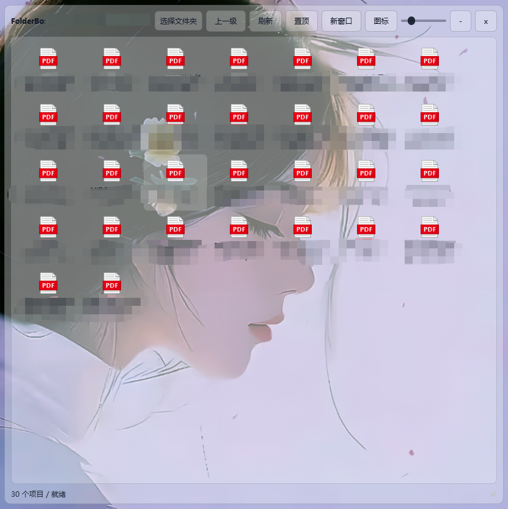

# FolderBox

**FolderBox** is a lightweight Windows desktop folder visualization tool built with Python and PySide6.

**FolderBox** 是一个使用 Python 和 PySide6 开发的轻量化 Windows 桌面文件夹可视化工具。

---

## English

FolderBox is not a traditional file manager. Its goal is to turn a real local folder into a small visual container on the desktop.

After selecting a folder, FolderBox displays the files and subfolders inside it in a movable, resizable, semi-transparent desktop window. Users can open files, enter subfolders, copy, paste, rename, delete to recycle bin, refresh, and show items in Windows File Explorer directly from this container.

The idea is simple:

```text
Real folder on disk  ->  Visual folder box on desktop
```

### Preview



> Note: File names in the screenshot have been pixelated for privacy.

For example, a folder such as:

```text
D:/Work/Paper
```

can be displayed as a compact desktop window where its contents can be viewed and managed without opening a full file explorer window.

### Key Features

- Bind a real local folder to a desktop window.
- Open multiple FolderBox windows at the same time.
- Use icon view or detail view, similar to Windows Explorer.
- Show file name, size, type, and modified time in detail view.
- Open files with the system default application.
- Enter subfolders inside the same FolderBox window.
- Copy, paste, rename, refresh, and delete files or folders.
- Move deleted items to the recycle bin instead of permanently deleting them.
- Drag files or folders from Windows Explorer into FolderBox.
- Keep file icons and text clear while only the background is transparent.
- Save window position, size, opacity, pinned state, folder path, and view mode.

### Design Goals

FolderBox is designed to be quiet, lightweight, and stable for long-term desktop use.

It avoids heavy dependencies and does not use Electron, WebView, web servers, thumbnail generation, high-frequency polling, or recursive disk scanning. File display is based on Qt's `QFileSystemModel`, so the current folder is loaded on demand with low CPU usage while idle.

### Tech Stack

- Python
- PySide6
- QFileSystemModel
- send2trash
- PyInstaller

---

## 中文

FolderBox 不是传统意义上的文件管理器。它的目标是把一个真实存在的本地文件夹，映射成桌面上的一个小型可视化容器。

用户选择某个文件夹后，FolderBox 会在桌面上显示一个可移动、可调整大小、半透明的窗口，并在窗口中展示该文件夹内的文件和子文件夹。用户可以直接在这个窗口中打开文件、进入子文件夹、复制、粘贴、重命名、删除到回收站、刷新，以及在 Windows 资源管理器中定位文件。

它的核心理念很简单：

```text
磁盘中的真实文件夹  ->  桌面上的可视化文件夹盒子
```

### 界面预览


> 备注：截图中的文件名因隐私原因已打上马赛克。

例如，一个真实文件夹：

```text
D:/Work/Paper
```

可以被显示成桌面上的一个紧凑窗口。用户不需要打开完整的资源管理器窗口，也可以快速查看和整理其中的内容。

### 主要功能

- 将真实本地文件夹绑定到桌面窗口。
- 支持同时打开多个 FolderBox 窗口。
- 支持图标视图和类似 Windows 资源管理器的详细信息视图。
- 详细信息视图可显示文件名、大小、类型和修改时间。
- 使用系统默认程序打开文件。
- 双击文件夹可在当前窗口中进入子文件夹。
- 支持复制、粘贴、重命名、刷新、删除文件或文件夹。
- 删除操作优先移入回收站，而不是永久删除。
- 支持从 Windows 资源管理器拖入文件或文件夹。
- 背景可透明，但文件图标和文字保持清晰不透明。
- 自动保存窗口位置、大小、透明度、置顶状态、绑定路径和视图模式。

### 设计目标

FolderBox 的设计目标是轻量、安静、稳定，适合长期停留在桌面上使用。

它避免使用 Electron、WebView、Web 服务、缩略图生成、高频轮询和递归磁盘扫描等重型方案。文件展示基于 Qt 的 `QFileSystemModel`，只按需加载当前文件夹内容，空闲时尽量保持低 CPU 占用。

### 技术栈

- Python
- PySide6
- QFileSystemModel
- send2trash
- PyInstaller
