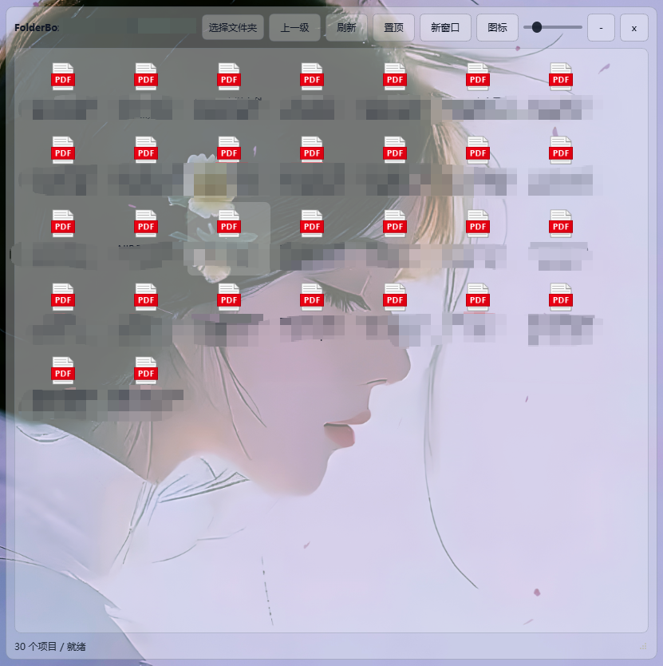

# FolderBox

**FolderBox** is a lightweight persistent folder portal for the Windows desktop, built with Python and PySide6.

**FolderBox** 是一个使用 Python 和 PySide6 开发的轻量化 Windows 桌面持久文件夹容器。

---

## English

FolderBox is not a traditional file manager. Its goal is to turn a real local folder into a small visual container on the desktop.

After selecting a folder, FolderBox displays the files and subfolders inside it in a movable, resizable, semi-transparent desktop window. Users can open files, enter subfolders, copy, paste, rename, delete to recycle bin, refresh, and show items in Windows File Explorer directly from this container.

The idea is simple:

```text
Real folder on disk  ->  Visual folder box on desktop
```

### Preview



For normal Windows use, download either the installer or portable package from GitHub Releases. For development, run `python -m pip install -e .` and launch with `folderbox`.

> Note: File names in the screenshot have been pixelated for privacy.

For example, a folder such as:

```text
D:/Work/Paper
```

can be displayed as a compact desktop window where its contents can be viewed and managed without opening a full file explorer window.

### Key Features

- Bind a real local folder to a desktop window.
- Open multiple FolderBox windows at the same time.
- Use icon view or detail view, similar to Windows Explorer.
- Show file name, size, type, and modified time in detail view.
- Open files with the system default application.
- Enter subfolders inside the same FolderBox window.
- Copy, cut, paste, move, rename, refresh, and delete files or folders.
- Create folders directly inside the current FolderBox.
- Run copy, move, and recycle-bin operations in background tasks so the UI stays responsive.
- Navigate with Back, Forward, Up, and a clickable breadcrumb path bar.
- Filter the current folder instantly by file name, with optional `*` and `?` wildcard patterns.
- Move deleted items to the recycle bin instead of permanently deleting them.
- Drag files or folders from Windows Explorer into FolderBox.
- Drag one or multiple selected files/folders out of FolderBox to the desktop, Explorer, or other file-drop targets.
- Keep file icons and text clear while only the background is transparent.
- Save window position, size, opacity, pinned state, folder path, and view mode.
- Keep FolderBox available from the Windows system tray.
- Hide or show all FolderBox windows from the tray.
- Enable or disable launch-at-login directly from the tray.
- Optionally add `Open in FolderBox` to Windows Explorer folder context menus.
- Route repeated launches and Explorer requests to the already-running FolderBox instance.
- Give each Box a custom title and lock its desktop position and size.
- Personalize each Box with light/dark theme, accent color, and icon size.
- Save named Workspaces and restore an entire multi-Box desktop layout in one action.
- Manage Workspaces from a dedicated visual manager while keeping tray-based quick switching.
- Assign an optional automatic layout policy to each Workspace so switching can reflow Boxes into grid, column, row, or cascade arrangements.
- Snap Boxes automatically to screen edges and neighboring Boxes, with optional manual edge/center placement.
- Arrange multiple visible Boxes with grid, horizontal-column, vertical-row, or cascade templates.
- Apply layout templates independently per monitor while leaving locked Boxes untouched.
- Optionally auto-hide an individual Box at a screen edge and expand it again when the pointer reaches the visible trigger strip.
- Switch to the previous or next Workspace directly from the tray.
- Hide or show every Box globally with `Ctrl+Alt+B` on Windows.

### Keyboard Shortcuts

| Shortcut | Action |
| --- | --- |
| `Ctrl+C` / `Ctrl+X` / `Ctrl+V` | Copy / cut / paste |
| `Ctrl+Shift+N` | Create folder |
| `Ctrl+F` | Focus current-folder filter |
| `Ctrl+Alt+B` | Globally hide / show all Boxes on Windows |
| `Ctrl + mouse wheel` | Change icon size in icon view |
| `Alt+Left` / `Alt+Right` | Back / forward |
| `Backspace` | Up one folder |
| `F2` | Rename selected item |
| `Delete` | Move selected items to recycle bin |
| `F5` | Refresh |

### Design Goals

FolderBox is designed to be quiet, lightweight, and stable for long-term desktop use.

It avoids heavy dependencies and does not use Electron, WebView, web servers, thumbnail generation, high-frequency polling, or recursive disk scanning. File display is based on Qt's `QFileSystemModel`, so the current folder is loaded on demand with low CPU usage while idle.

### Tech Stack

- Python
- PySide6
- QFileSystemModel
- send2trash
- PyInstaller

---

## 中文

FolderBox 不是传统意义上的文件管理器。它的目标是把一个真实存在的本地文件夹，映射成桌面上的一个小型可视化容器。

用户选择某个文件夹后，FolderBox 会在桌面上显示一个可移动、可调整大小、半透明的窗口，并在窗口中展示该文件夹内的文件和子文件夹。用户可以直接在这个窗口中打开文件、进入子文件夹、复制、粘贴、重命名、删除到回收站、刷新，以及在 Windows 资源管理器中定位文件。

它的核心理念很简单：

```text
磁盘中的真实文件夹  ->  桌面上的可视化文件夹盒子
```

### 界面预览


普通 Windows 用户可直接从 GitHub Releases 下载安装版或 Portable 便携版。开发环境可执行 `python -m pip install -e .` 安装，然后使用 `folderbox` 启动。

> 备注：截图中的文件名因隐私原因已打上马赛克。

例如，一个真实文件夹：

```text
D:/Work/Paper
```

可以被显示成桌面上的一个紧凑窗口。用户不需要打开完整的资源管理器窗口，也可以快速查看和整理其中的内容。

### 主要功能

- 将真实本地文件夹绑定到桌面窗口。
- 支持同时打开多个 FolderBox 窗口。
- 支持图标视图和类似 Windows 资源管理器的详细信息视图。
- 详细信息视图可显示文件名、大小、类型和修改时间。
- 使用系统默认程序打开文件。
- 双击文件夹可在当前窗口中进入子文件夹。
- 支持复制、剪切、粘贴、移动、重命名、刷新、删除文件或文件夹。
- 支持直接在当前 FolderBox 中新建文件夹。
- 复制、移动和移入回收站等文件操作使用后台任务执行，减少界面卡顿。
- 支持后退、前进、返回上一级以及可点击的 Breadcrumb 路径导航。
- 支持按文件名快速过滤当前目录，并可使用 `*`、`?` 通配符。
- 删除操作优先移入回收站，而不是永久删除。
- 支持从 Windows 资源管理器拖入文件或文件夹。
- 支持将一个或多个选中项目从 FolderBox 拖到桌面、资源管理器或其他文件拖放目标。
- 背景可透明，但文件图标和文字保持清晰不透明。
- 自动保存窗口位置、大小、透明度、置顶状态、绑定路径和视图模式。
- 支持 Windows 系统托盘常驻。
- 可从托盘一键隐藏或显示全部 FolderBox。
- 可直接在托盘中开启或关闭 Windows 开机启动。
- 可选启用 Windows 资源管理器文件夹右键菜单中的 `Open in FolderBox`。
- 重复启动和资源管理器目录请求会转发给已运行的 FolderBox 实例，不重复创建托盘进程。
- 每个 Box 可设置独立名称，并可锁定桌面位置和大小。
- 每个 Box 可独立设置浅色/深色主题、强调色和图标大小。
- 支持命名 Workspace，一次保存和恢复整套多 Box 桌面布局。
- 提供独立 Workspace 管理窗口，同时保留托盘快速切换。
- 可为每个 Workspace 设置独立自动布局策略，切换时自动按网格、横向分栏、纵向分栏或瀑布模式重新整理 Box。
- Box 可自动吸附到屏幕边缘或相邻 Box，并支持一键贴左、贴右、贴上、贴下和居中。
- 支持将多个可见 Box 一键整理为均衡网格、横向分栏、纵向分栏或瀑布层叠。
- 多显示器会分别整理各自屏幕上的 Box，已锁定 Box 不参与自动排列。
- 每个 Box 可独立开启边缘自动收起；移出鼠标后仅保留窄触发条，鼠标触碰后立即展开。
- 可直接从托盘切换上一个或下一个 Workspace。
- Windows 下可使用全局快捷键 `Ctrl+Alt+B` 一键隐藏或显示全部 Box。

### 常用快捷键

| 快捷键 | 功能 |
| --- | --- |
| `Ctrl+C` / `Ctrl+X` / `Ctrl+V` | 复制 / 剪切 / 粘贴 |
| `Ctrl+Shift+N` | 新建文件夹 |
| `Ctrl+F` | 聚焦当前目录过滤框 |
| `Ctrl+Alt+B` | Windows 下全局隐藏 / 显示全部 Box |
| `Ctrl + 鼠标滚轮` | 调整图标视图的图标大小 |
| `Alt+Left` / `Alt+Right` | 后退 / 前进 |
| `Backspace` | 返回上一级 |
| `F2` | 重命名选中项目 |
| `Delete` | 将选中项目移入回收站 |
| `F5` | 刷新 |

### 设计目标

FolderBox 的设计目标是轻量、安静、稳定，适合长期停留在桌面上使用。

它避免使用 Electron、WebView、Web 服务、缩略图生成、高频轮询和递归磁盘扫描等重型方案。文件展示基于 Qt 的 `QFileSystemModel`，只按需加载当前文件夹内容，空闲时尽量保持低 CPU 占用。

### 技术栈

- Python
- PySide6
- QFileSystemModel
- send2trash
- PyInstaller
